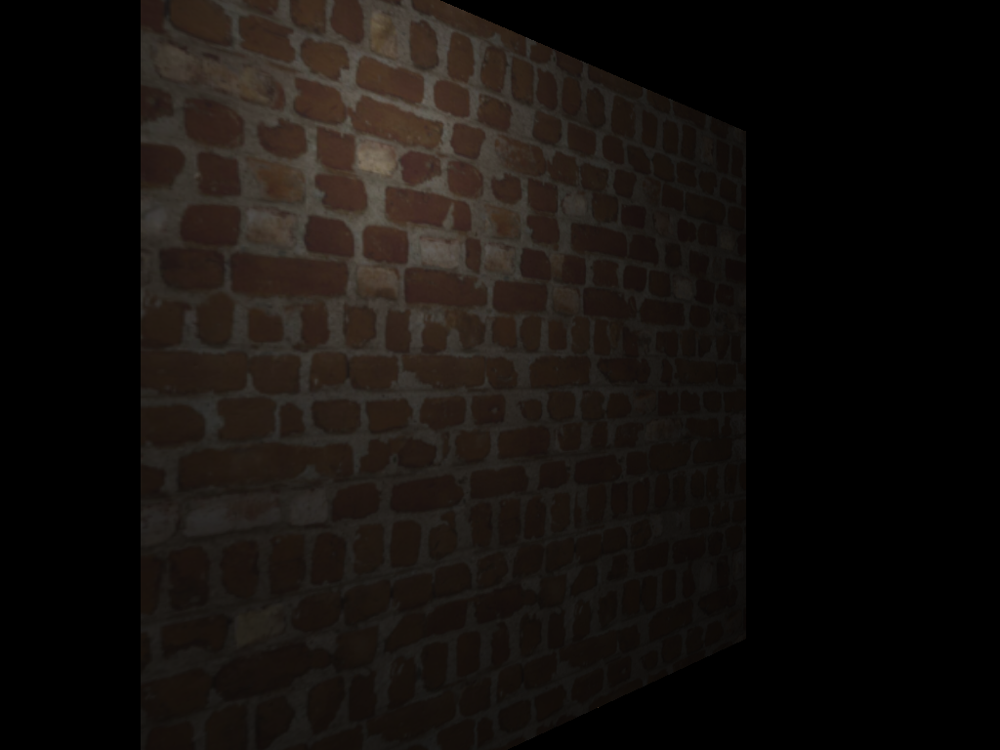
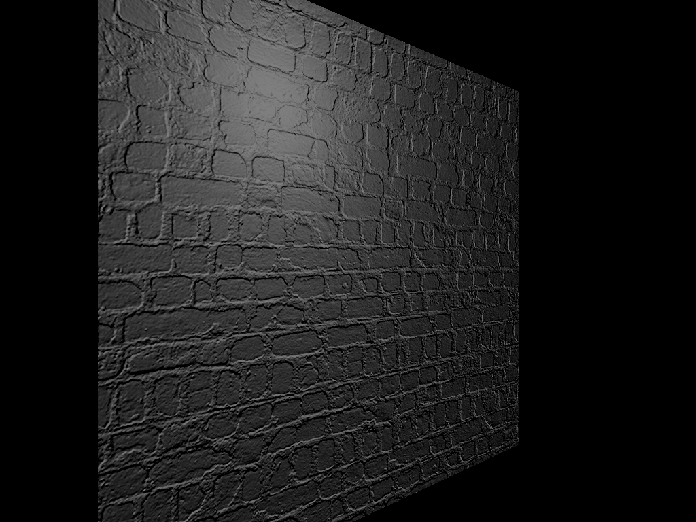
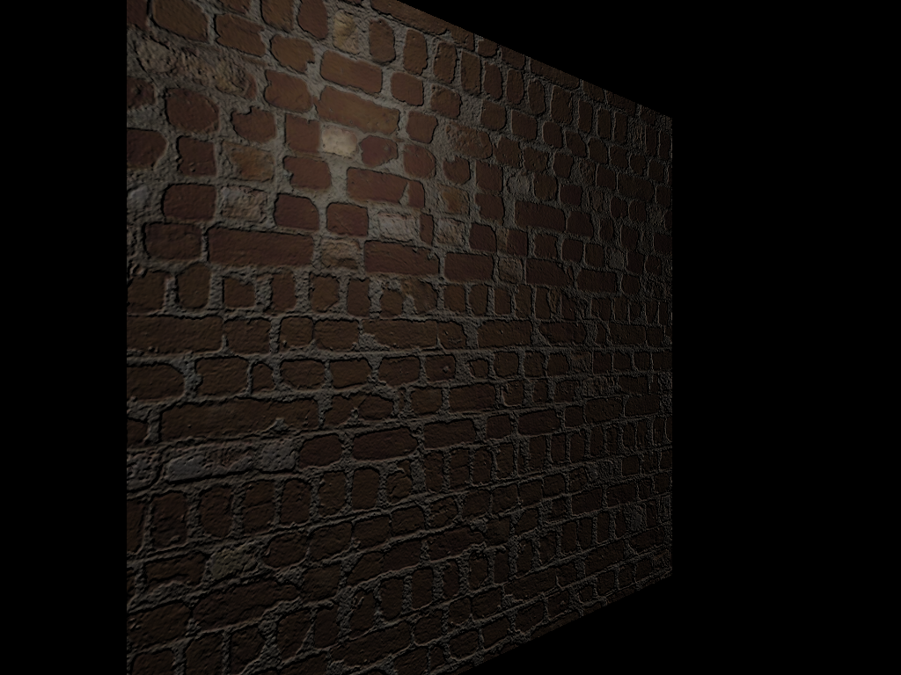
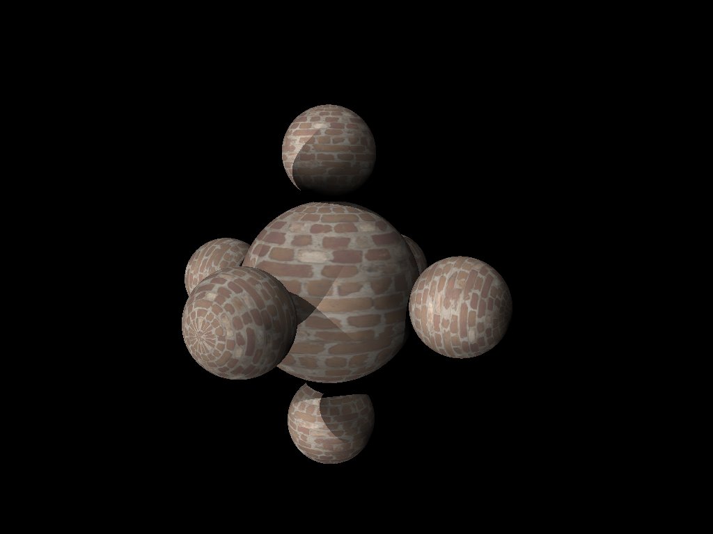
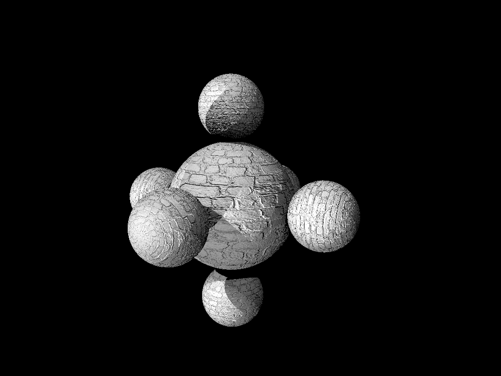
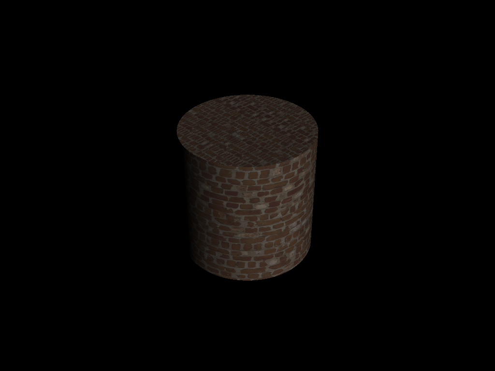
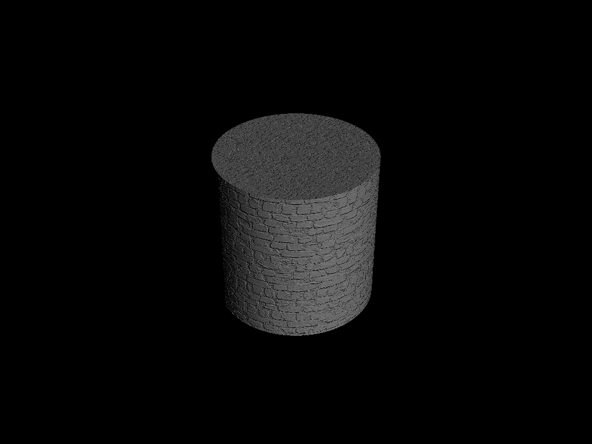
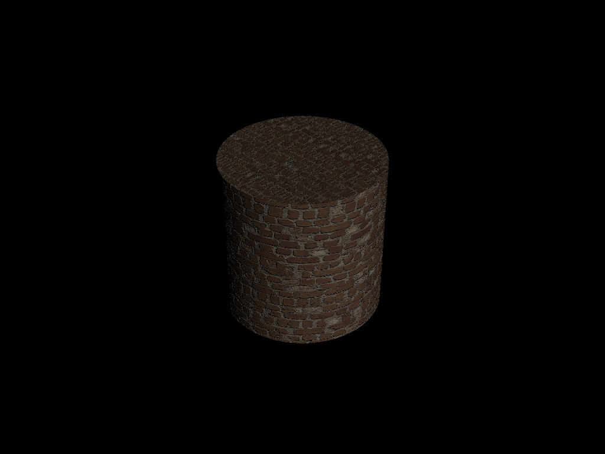
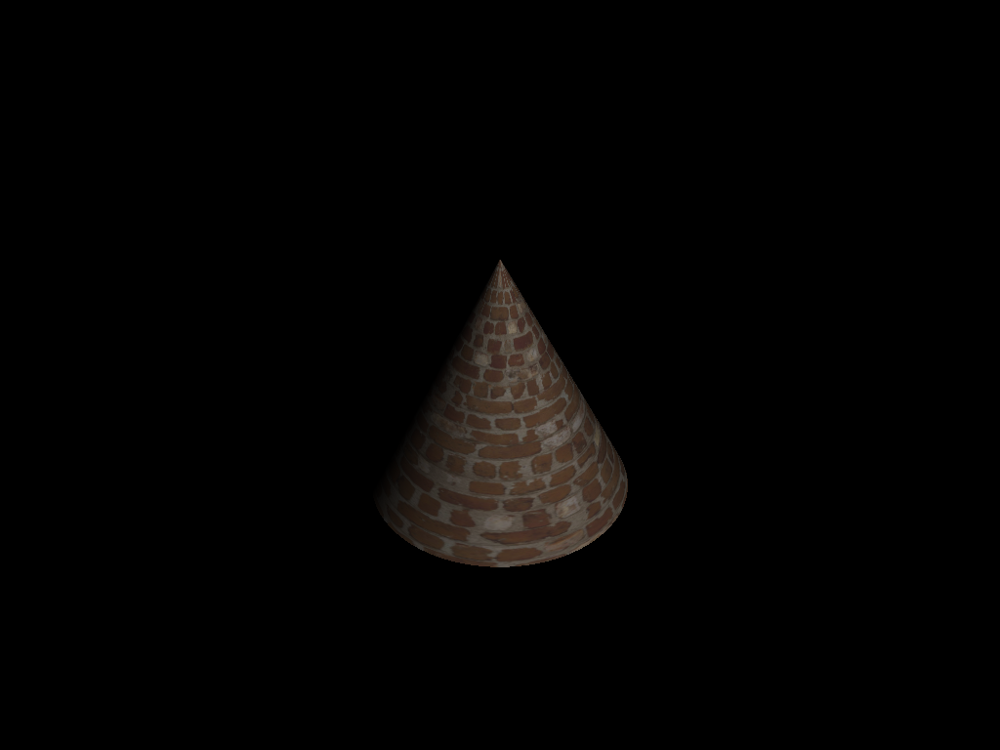

# Final Project 6 Submission

## Acceleration Structure Tests (4 stars)

The following tests were run on a machine with an AMD Ryzen 9 6900HS CPU and 32GB of RAM.
I disabled reflection and shadows to keep comparisons simple and focused on primary rays only.

| scenefile            | kdtree_build_time | kdtree_render_time | unaccelerated_render_time |
|----------------------|-------------------|--------------------|---------------------------|
| recursive_spheres_2  | 0.00              | 0.12               | 0.10                      |
| recursive_spheres_3  | 0.00              | 0.24               | 0.29                      |
| recursive_spheres_4  | 0.00              | 0.37               | 1.14                      |
| recursive_spheres_5  | 0.00              | 0.46               | 4.65                      |
| recursive_spheres_6  | 0.01              | 0.66               | 25.88                     |
| recursive_spheres_7  | 0.05              | 1.12               | 134.19                    |
| recursive_spheres_8  | 0.25              | 2.53               | >300                      |
| recursive_spheres_9  | 1.36              | 8.21               | >300                      |
| recursive_spheres_10 | 7.86              | 64.97              | >300                      |
| primitive_salad_1    | 0.00              | 0.41               | 0.66                      |
| primitive_salad_2    | 0.00              | 2.50               | 11.93                     |

However, I also tested edge cases for shadows and reflections to ensure correctness when accelerated.
I found that the acceleration structure still keeps performance reasonable despite multiplying the number and variability of rays by including secondary rays.

| scenefile (with shadows and reflections) | kdtree_render_time |
|------------------------------------------|--------------------|
| recursive_spheres_2                      | 0.21               |
| recursive_spheres_3                      | 0.64               |
| recursive_spheres_4                      | 1.35               |
| recursive_spheres_5                      | 2.07               |
| recursive_spheres_6                      | 4.10               |
| recursive_spheres_7                      | 9.34               |
| recursive_spheres_8                      | 30.18              |
| recursive_spheres_9                      | 109.30             |
| recursive_spheres_10                     | >300               |
| primitive_salad_1                        | 1.00               |
| primitive_salad_2                        | 13.77              |

Finally, I ran my acceleration structure on more complex scenes from illuminate and antialias to test compatibility. No issues were found.

## Bump Mapping Tests (3 stars)
| Method To Produce Output    | Texture Output                          | Bump Output                          | Final Render Output                     |
| :-------------------------: | :----------------------------------:    | :---------------------------------:  | :-------------------------------------: |
| brick_wall                  |      |      |              |
| brick_spheres               |   |   |           |
| brick_cylinder              |  |  |          |
| brick_cone                  |      |      |              |

## Design Choices

- For the acceleration structure, I implemented KD-Trees
  - The building of the tree is done in kdtree.cpp using SAH as a splitting heuristic
  - During traversal, I keep track of ray_id (the number of pixels rendered so far) and last_visited which tells me if I've already checked an object in this ray iteration
  - I made sure to optimize for branch elimination during traversal by ordering child nodes based on ray traversal direction
- For bump mapping, I put all the code in textures.cpp
  - I compute the height map gradients ahead of time during scene initialization to avoid recomputing for every lookup
  - Instead of calculating du/dp and dv/dp, I had to calculate dp/du and dp/dv
  - I give the user the option to choose betweeen nearest and bilinear interpolation for bump map gradients

## Collaboration / References
- Lots of ChatGPT and Copilot
- [Bump Mapping Slides](https://cgl.ethz.ch/teaching/former/gdv1_04/GDV1_WS04/exercise/P6_Bump_mapping_hints.pdf)

## Known Bugs
- The bump map outputs have black speckles (aliasing) when the texture is clumped up.
  - I believe this is due to speckles in the original brick wall texture
  - This is somewhat alleviated by applying bilinear interpolation when sampling the bump map
